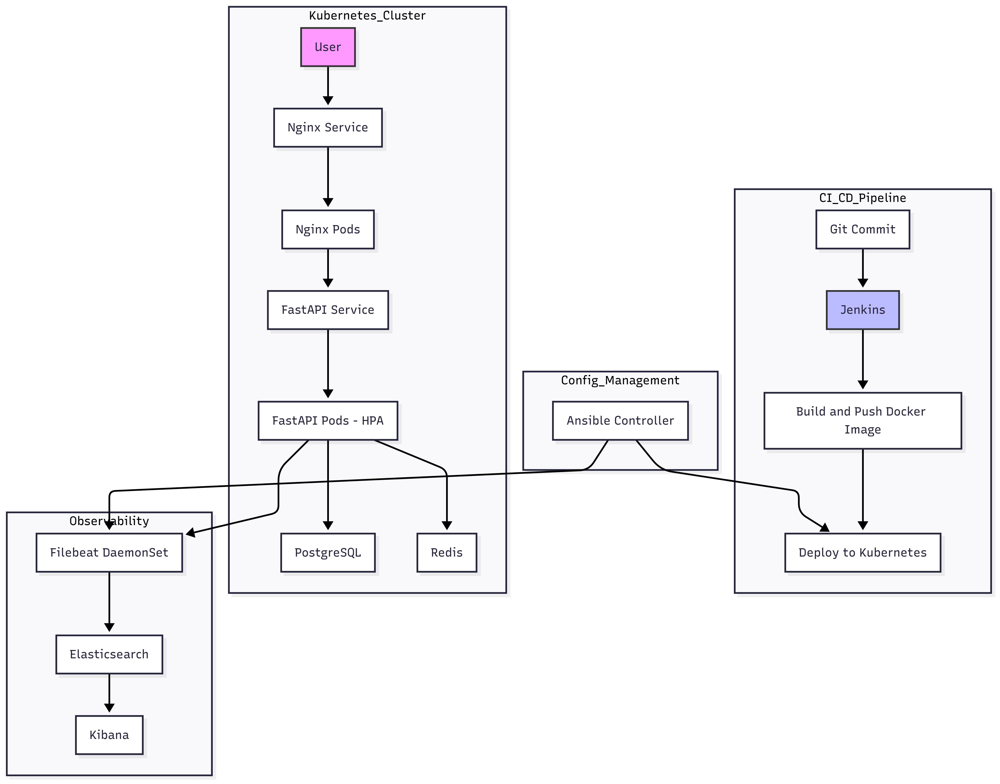

# QnaOps: End-to-End DevOps Automation 🚀


[](LICENSE)
[](https://github.com/Peddinti-Sriram-Bharadwaj/QnaOps/stargazers)
[](https://github.com/Peddinti-Sriram-Bharadwaj/QnaOps/commits/main)
[](https://github.com/Peddinti-Sriram-Bharadwaj/QnaOps/issues)
[](https://github.com/Peddinti-Sriram-Bharadwaj/QnaOps/network/members)
[](https://github.com/Peddinti-Sriram-Bharadwaj/QnaOps/graphs/contributors)

An advanced project showcasing a full-stack DevOps implementation for a containerized microservices architecture deployed on Kubernetes. This repository provides a blueprint for **Infrastructure as Code (IaC)**, **Configuration as Code (CaC)**, **CI/CD**, and **Observability**.

---

## 📚 Table of Contents

* [🏗️ Solution Architecture](#%EF%B8%8F-solution-architecture)
* [⚙️ Technical Deep Dive](#%EF%B8%8F-technical-deep-dive)
* [🛠️ Prerequisites](#%EF%B8%8F-prerequisites)
* [🚀 Getting Started](#%F0%9F%9A%80-getting-started)
* [🔬 Usage & Automation Scripts](#%F0%9F%94%AC-usage--automation-scripts)
* [🔄 CI/CD & DevOps Workflow](#%F0%9F%94%84-cicd--devops-workflow)
* [📊 Observability Stack](#%F0%9F%93%8A-observability-stack)
* [🤝 Contribution Guidelines](#%F0%9F%A4%9D-contribution-guidelines)
* [📂 Repository Structure](#%F0%9F%93%82-repository-structure)

---

## 🏗️ Solution Architecture

> 📌 GitHub does not render Mermaid diagrams. Here's a rendered architecture diagram:



---

## ⚙️ Technical Deep Dive

* **`fastapi_app/`**: Python application built with FastAPI, known for speed and OpenAPI documentation.

  * Contains business logic.
  * Dockerized for deployment.

* **`k8s/`**: Kubernetes manifests (IaC).

  * `fastapi-deployment.yaml`: Deployment for FastAPI pods.
  * `fastapi-hpa.yaml`: HorizontalPodAutoscaler for scaling.
  * `postgres.yaml` & `redis.yaml`: StatefulSets for DB and cache.
  * `nginx-deployment.yaml` & `nginx-configmap.yaml`: NGINX reverse proxy with traffic routing rules.

* **`ansible/`**: Configuration as Code (CaC).

  * Automates database setup, app configs, EFK stack deployment.
  * Uses Ansible Vault via `secrets.yaml` and `vault_pass.txt`.

* **`Jenkinsfile`**: Declarative CI/CD pipeline.

  * Automates build, push, deploy, and rollouts.

---

## 🛠️ Prerequisites

Ensure the following are installed:

* [Minikube](https://minikube.sigs.k8s.io/docs/)
* [kubectl](https://kubernetes.io/docs/tasks/tools/)
* [Docker](https://docs.docker.com/)
* [Ansible](https://www.ansible.com/)
* [Jenkins](https://www.jenkins.io/)

---

## 🚀 Getting Started

### 1. Clone the Repository

```bash
git clone https://github.com/Peddinti-Sriram-Bharadwaj/QnaOps.git
cd QnaOps
```

### 2. Initialize the Environment

```bash
./minikube-start.sh
```

### 3. Deploy Kubernetes Resources

```bash
kubectl apply -f k8s/
```

### 4. Run Ansible Playbooks

```bash
ansible-playbook ansible/deploy-app.yaml --vault-password-file ansible/vault_pass.txt
```

---

## 🔬 Usage & Automation Scripts

| Script           | Icon | Description                               |
| ---------------- | :--: | ----------------------------------------- |
| `get-url.sh`     |  🔗  | Fetch Minikube service URL to access app  |
| `get_pods.sh`    |  📦  | List all running pods                     |
| `rollout_app.sh` |  🔄  | Trigger rolling restart of FastAPI        |
| `load-test.sh`   |   ⚡  | Run load test on FastAPI endpoint         |
| `hpa-usage.sh`   |  📊  | Show current HPA status                   |
| `forward-*.sh`   |  🔌  | Forward Redis/Postgres ports to localhost |
| `get-*-pass.sh`  |  🔑  | Retrieve secrets from Kubernetes          |

---

## 🔄 CI/CD & DevOps Workflow

**Pipeline Stages:**

1. **Trigger**: On commit to `main` branch
2. **Lint & Test** *(Optional)*: Run static and unit tests
3. **Build**: Executes `build_and_push.sh` to create Docker image
4. **Push**: Tags and pushes to container registry
5. **Deploy**: Jenkins updates FastAPI deployment with new image tag

> Supports zero-downtime rolling deployments.

---

## 📊 Observability Stack

Deployed using Ansible and integrated into Kubernetes:

* **Filebeat**: Collects logs from all pods (DaemonSet)
* **Elasticsearch**: Stores and indexes logs
* **Kibana**: Web interface for visualizing logs and creating dashboards
* **Metricbeat** *(optional)*: Collects system/service metrics

> Use `kibana-forward.sh` and `elastic-forward.sh` to access dashboards locally.

---

## 🤝 Contribution Guidelines

We welcome all contributions! 🚀

**Steps to Contribute:**

1. Fork this repository
2. Create a new branch: `git checkout -b feat/your-feature`
3. Develop and test in local Minikube
4. Follow [Conventional Commits](https://www.conventionalcommits.org/en/v1.0.0/) format
5. Push your branch and create a PR against `main`

> For full details, see [CONTRIBUTING.md](CONTRIBUTING.md)

---

## 📂 Repository Structure

```
QnaOps/
├── ansible/               # Ansible playbooks and vault
├── fastapi_app/           # FastAPI source code
├── k8s/                   # Kubernetes manifests
├── scripts/               # Utility scripts
├── Jenkinsfile            # CI/CD pipeline
├── assets/                # Architecture diagrams, dashboards
└── README.md              # Project documentation
```

---

Made with ❤️ by [Sriram Bharadwaj](https://github.com/Peddinti-Sriram-Bharadwaj)
